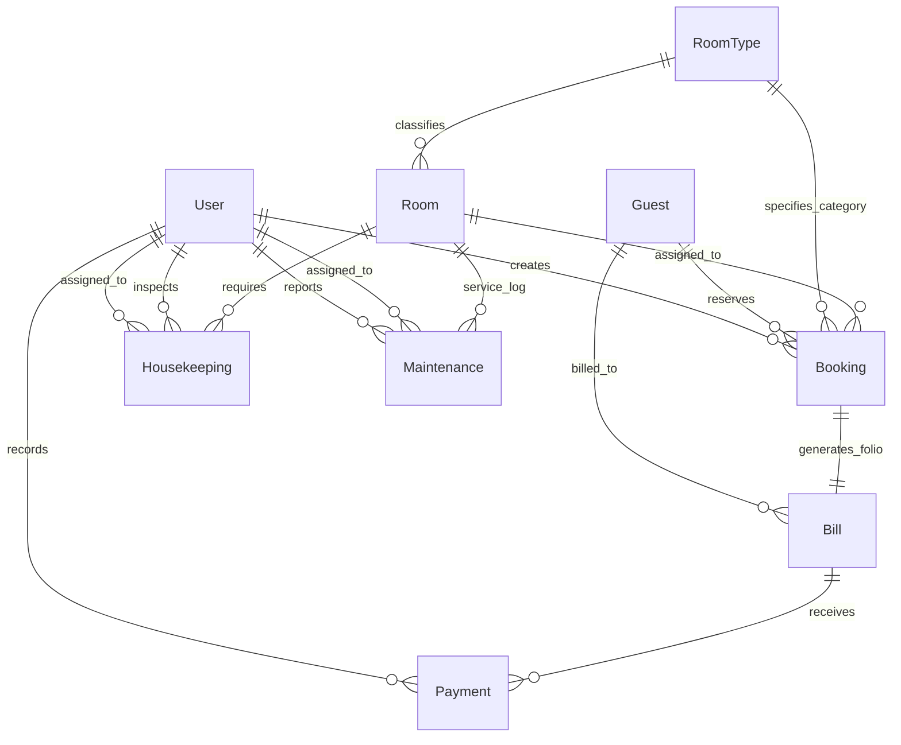
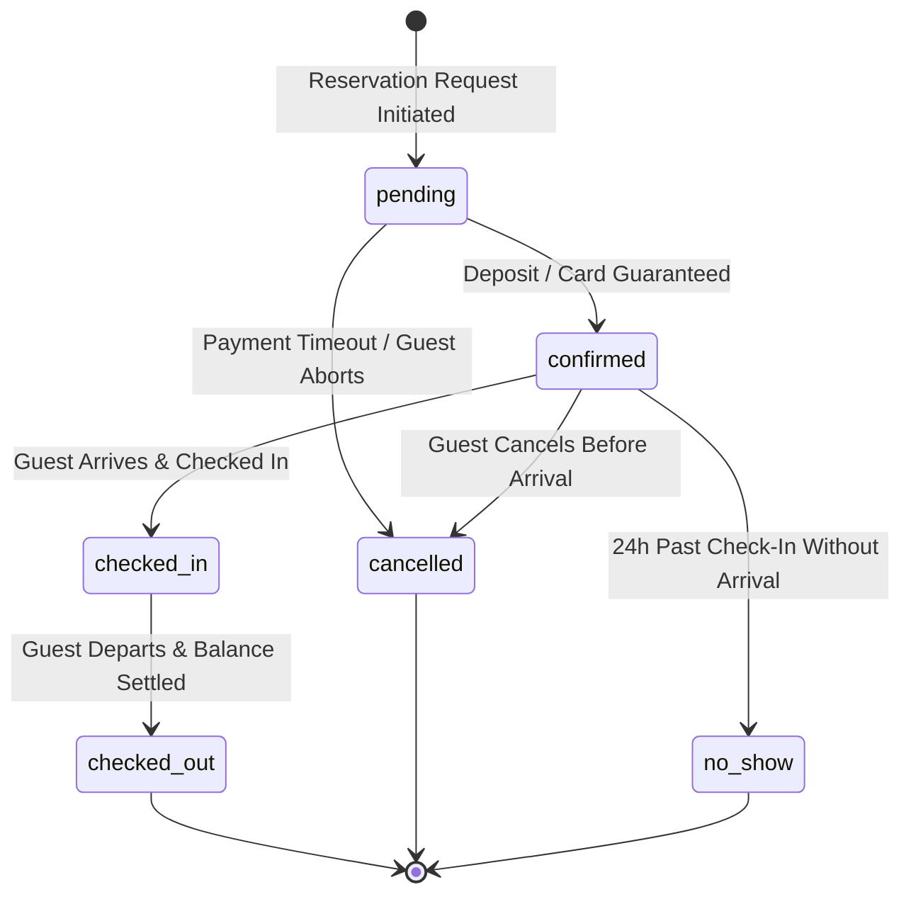
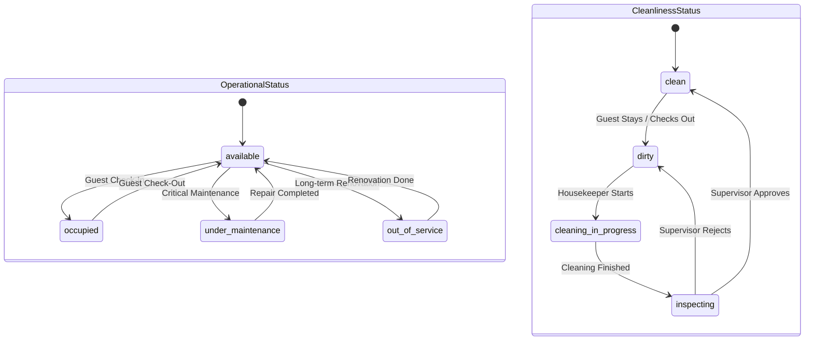

# Production Hotel Domain Model & Database Architecture

**Date:** 2026-09-11  
**Project:** Hotel Management System  
**Document:** `docs/DOMAIN_DESIGN.md`  
**Status:** Architectural Specification  

---

## 1. Executive Summary & Audit of Existing Database Architecture

An audit of the existing backend models (`backend/app/models/`), services (`backend/app/services/`), routes (`backend/app/routes/`), and legacy database schema (`hotel-management-system/hotel_db.sql`) revealed substantial design limitations that prevent production deployment.

### 1.1 Key Deficiencies Identified in the Current Design

1. **Missing Domain Models & Disconnect with SQL**:
   * `hotel_db.sql` specifies 5 tables (`users`, `rooms`, `guests`, `bookings`, `bills`).
   * However, `backend/app/models/` implements only 3 SQLAlchemy models: `User`, `Room`, and `Booking`.
   * Neither `Guest` nor `Bill` exists as an ORM model in the backend, making guest profile management and invoicing impossible via SQLAlchemy.
2. **Missing Room Abstraction (`RoomType`)**:
   * `room_type` is stored as an unconstrained string (`VARCHAR(50)`) inside `rooms`.
   * There is no central definition of base room rates, bed arrangements, maximum capacity, or amenities. Room pricing cannot be updated per category.
3. **Flawed Booking Logic & Instant-Occupancy Fallacy**:
   * `booking_service.py` (`create_booking`) sets `room.status = "occupied"` immediately upon booking creation.
   * `check_in_date` and `check_out_date` are not even accepted in `create_booking()`.
   * Reserving a room for next week immediately renders it unavailable today, preventing advance reservations.
4. **Missing Relational Integrity**:
   * In `Booking` (`backend/app/models/booking_model.py`), `guest_id` and `room_id` are plain integer columns with no foreign key constraints (`db.ForeignKey`) and no ORM relationships (`db.relationship`).
   * Cascade rules, referential integrity, and join navigations (`booking.room`, `booking.guest`) are completely absent.
5. **Conflated Housekeeping & Operational States**:
   * `Room` uses a single `cleaned` boolean column alongside `status` (`available`, `occupied`).
   * In reality, a room's operational status (available, occupied, maintenance, out-of-service) is orthogonal to its hygiene status (clean, dirty, inspecting, cleaning in progress).
6. **No Payment, Maintenance, or Housekeeping Systems**:
   * No `Payment` entity exists (the legacy `bills` table only records an amount, with no transaction references, payment methods, partial payments, or refunds).
   * No facilities exist to schedule housekeeping staff, verify room inspections, or track maintenance repair orders.

---

## 2. Production-Ready Entity-Relationship Architecture

The production domain model establishes 9 core entities:
1. **`User`**: System staff accounts, role-based access control, and audit logs.
2. **`Guest`**: Customer records, contact info, identity verification (KYC), and stay history.
3. **`RoomType`**: Centralized category catalog, base rates, occupancy limits, and amenities.
4. **`Room`**: Physical inventory, floor assignments, operational and cleanliness states.
5. **`Booking`**: Temporal reservation contract spanning calendar dates with guest associations.
6. **`Bill`**: Master financial folio aggregating charges, taxes, discounts, and outstanding balance.
7. **`Payment`**: Individual transaction records (deposits, gateway charges, refunds, partial payments).
8. **`Housekeeping`**: Work orders, shift tasks, room sanitization, and supervisor inspections.
9. **`Maintenance`**: Work orders, facility repairs, equipment tracking, and room occupancy holds.



---

## 3. Detailed Entity Specifications

### 3.1 Entity: `User`
Manages administrative, front desk, housekeeping, and maintenance personnel.

| Attribute | SQL Type | Nullable | Key / Constraint | Description |
| :--- | :--- | :--- | :--- | :--- |
| `user_id` | `INT AUTO_INCREMENT` | No | **PK** | Surrogate identifier. |
| `username` | `VARCHAR(50)` | No | **UNIQUE** | Login username (case-insensitive search). |
| `email` | `VARCHAR(120)` | No | **UNIQUE** | Corporate staff email. |
| `password_hash` | `VARCHAR(255)` | No | — | Secure hash (PBKDF2 / Argon2 / bcrypt). |
| `full_name` | `VARCHAR(100)` | No | — | Staff member's legal full name. |
| `role` | `ENUM(...)` | No | Default: `'receptionist'` | Allowed: `'admin'`, `'manager'`, `'receptionist'`, `'housekeeper'`, `'maintenance'`. |
| `is_active` | `BOOLEAN` | No | Default: `TRUE` | Soft deactivation flag. |
| `created_at` | `DATETIME` | No | Default: `CURRENT_TIMESTAMP` | Account creation timestamp. |
| `updated_at` | `DATETIME` | No | On update: `CURRENT_TIMESTAMP` | Last profile update. |

* **Primary Key**: `user_id`
* **Foreign Keys**: None
* **Relationships**:
  * `bookings_created` -> One-to-Many with `Booking` (`Booking.created_by_user_id`)
  * `payments_recorded` -> One-to-Many with `Payment` (`Payment.recorded_by_user_id`)
  * `housekeeping_tasks` -> One-to-Many with `Housekeeping` (`Housekeeping.assigned_to_user_id`)
  * `inspections_performed` -> One-to-Many with `Housekeeping` (`Housekeeping.inspected_by_user_id`)
  * `maintenance_assigned` -> One-to-Many with `Maintenance` (`Maintenance.assigned_to_user_id`)
* **Important Constraints**:
  * `UNIQUE(username)`
  * `UNIQUE(email)`
  * `CHECK (role IN ('admin', 'manager', 'receptionist', 'housekeeper', 'maintenance'))`
* **Status Fields / Enums**:
  * `role`: `'admin'`, `'manager'`, `'receptionist'`, `'housekeeper'`, `'maintenance'`
  * `is_active`: `TRUE`, `FALSE`
* **Indexes**:
  * `idx_users_username`: `UNIQUE(username)`
  * `idx_users_email`: `UNIQUE(email)`
  * `idx_users_role`: `INDEX(role, is_active)`

---

### 3.2 Entity: `Guest`
Stores customer profile information, contact points, and identity verification credentials (KYC).

| Attribute | SQL Type | Nullable | Key / Constraint | Description |
| :--- | :--- | :--- | :--- | :--- |
| `guest_id` | `INT AUTO_INCREMENT` | No | **PK** | Unique guest identifier. |
| `first_name` | `VARCHAR(50)` | No | — | Guest given name. |
| `last_name` | `VARCHAR(50)` | No | — | Guest surname. |
| `email` | `VARCHAR(120)` | Yes | — | Contact email for confirmations and invoices. |
| `phone` | `VARCHAR(25)` | No | — | Primary mobile phone number with country code. |
| `id_type` | `ENUM(...)` | Yes | — | Allowed: `'passport'`, `'national_id'`, `'driving_license'`, `'other'`. |
| `id_number` | `VARCHAR(50)` | Yes | — | Identification document serial number. |
| `address` | `TEXT` | Yes | — | Residential street address. |
| `city` | `VARCHAR(50)` | Yes | — | City of residence. |
| `country` | `VARCHAR(50)` | Yes | — | Country of citizenship or residence. |
| `postal_code` | `VARCHAR(20)` | Yes | — | Postal / ZIP code. |
| `vip_status` | `BOOLEAN` | No | Default: `FALSE` | VIP recognition flag for loyalty perks. |
| `notes` | `TEXT` | Yes | — | Preferences (e.g. high floor, extra pillows). |
| `created_at` | `DATETIME` | No | Default: `CURRENT_TIMESTAMP` | Profile creation timestamp. |
| `updated_at` | `DATETIME` | No | On update: `CURRENT_TIMESTAMP` | Last profile update. |

* **Primary Key**: `guest_id`
* **Foreign Keys**: None
* **Relationships**:
  * `bookings` -> One-to-Many with `Booking` (`Booking.guest_id`)
  * `bills` -> One-to-Many with `Bill` (`Bill.guest_id`)
* **Important Constraints**:
  * `CONSTRAINT chk_phone_not_empty CHECK (LENGTH(TRIM(phone)) > 0)`
  * `UNIQUE KEY uq_guest_id_doc (id_type, id_number)` (when document is supplied)
* **Status Fields / Enums**:
  * `id_type`: `'passport'`, `'national_id'`, `'driving_license'`, `'other'`
  * `vip_status`: `TRUE`, `FALSE`
* **Indexes**:
  * `idx_guests_phone`: `INDEX(phone)`
  * `idx_guests_email`: `INDEX(email)`
  * `idx_guests_name`: `INDEX(last_name, first_name)`
  * `idx_guests_id_doc`: `INDEX(id_type, id_number)`

---

### 3.3 Entity: `RoomType`
Defines room categories, standard inventory pricing, maximum occupancy rules, and facility features.

| Attribute | SQL Type | Nullable | Key / Constraint | Description |
| :--- | :--- | :--- | :--- | :--- |
| `room_type_id` | `INT AUTO_INCREMENT` | No | **PK** | Identifier for room type. |
| `name` | `VARCHAR(50)` | No | **UNIQUE** | Category name (e.g. 'Single Standard', 'Deluxe Suite'). |
| `code` | `VARCHAR(20)` | No | **UNIQUE** | Short alphanumeric code (e.g. `'SGL'`, `'DLX'`). |
| `description` | `TEXT` | Yes | — | Marketing description of the room tier. |
| `base_price` | `DECIMAL(10, 2)` | No | `CHECK (base_price >= 0)` | Standard nightly rate. |
| `max_occupancy` | `INT` | No | Default: `2`, `CHECK (> 0)` | Maximum adult + child capacity. |
| `bed_config` | `VARCHAR(60)` | No | — | Description of beds (e.g. `'1 King'`, `'2 Twins'`). |
| `amenities` | `JSON` | Yes | — | Structured list of features (e.g. `["wifi", "balcony", "minibar"]`). |
| `is_active` | `BOOLEAN` | No | Default: `TRUE` | Whether available for new bookings. |
| `created_at` | `DATETIME` | No | Default: `CURRENT_TIMESTAMP` | Creation timestamp. |
| `updated_at` | `DATETIME` | No | On update: `CURRENT_TIMESTAMP` | Modification timestamp. |

* **Primary Key**: `room_type_id`
* **Foreign Keys**: None
* **Relationships**:
  * `rooms` -> One-to-Many with `Room` (`Room.room_type_id`)
  * `bookings` -> One-to-Many with `Booking` (`Booking.room_type_id`)
* **Important Constraints**:
  * `UNIQUE(name)`
  * `UNIQUE(code)`
  * `CHECK (base_price >= 0)`
  * `CHECK (max_occupancy >= 1)`
* **Status Fields / Enums**:
  * `is_active`: `TRUE`, `FALSE`
* **Indexes**:
  * `idx_room_types_code`: `UNIQUE(code)`
  * `idx_room_types_active`: `INDEX(is_active)`

---

### 3.4 Entity: `Room`
Represents an individual, physical room on the property.

| Attribute | SQL Type | Nullable | Key / Constraint | Description |
| :--- | :--- | :--- | :--- | :--- |
| `room_id` | `INT AUTO_INCREMENT` | No | **PK** | Physical room inventory identifier. |
| `room_number` | `VARCHAR(20)` | No | **UNIQUE** | Physical door/room label (e.g. `'101'`, `'PH-1'`). |
| `floor` | `INT` | No | — | Floor number (e.g. `1`, `2`, `-1` for lower levels). |
| `room_type_id` | `INT` | No | **FK** -> `room_types` | Associated room category. |
| `operational_status`| `ENUM(...)` | No | Default: `'available'` | Allowed: `'available'`, `'occupied'`, `'out_of_service'`, `'under_maintenance'`. |
| `cleanliness_status`| `ENUM(...)` | No | Default: `'clean'` | Allowed: `'clean'`, `'dirty'`, `'inspecting'`, `'cleaning_in_progress'`. |
| `is_smoking` | `BOOLEAN` | No | Default: `FALSE` | Smoking policy flag. |
| `notes` | `TEXT` | Yes | — | Specific maintenance or layout notes. |
| `created_at` | `DATETIME` | No | Default: `CURRENT_TIMESTAMP` | Timestamp created. |
| `updated_at` | `DATETIME` | No | On update: `CURRENT_TIMESTAMP` | Timestamp updated. |

* **Primary Key**: `room_id`
* **Foreign Keys**:
  * `room_type_id` -> `room_types(room_type_id) ON DELETE RESTRICT`
* **Relationships**:
  * `room_type` -> Many-to-One with `RoomType`
  * `bookings` -> One-to-Many with `Booking` (`Booking.room_id`)
  * `housekeeping_records` -> One-to-Many with `Housekeeping` (`Housekeeping.room_id`)
  * `maintenance_records` -> One-to-Many with `Maintenance` (`Maintenance.room_id`)
* **Important Constraints**:
  * `UNIQUE(room_number)`
  * `CHECK (floor >= -2)`
* **Status Fields / Enums**:
  * `operational_status`: `'available'`, `'occupied'`, `'out_of_service'`, `'under_maintenance'`
  * `cleanliness_status`: `'clean'`, `'dirty'`, `'inspecting'`, `'cleaning_in_progress'`
* **Indexes**:
  * `idx_rooms_number`: `UNIQUE(room_number)`
  * `idx_rooms_type_status`: `INDEX(room_type_id, operational_status, cleanliness_status)`
  * `idx_rooms_floor`: `INDEX(floor)`

---

### 3.5 Entity: `Booking`
Represents a stay reservation across specific dates for a guest.

| Attribute | SQL Type | Nullable | Key / Constraint | Description |
| :--- | :--- | :--- | :--- | :--- |
| `booking_id` | `INT AUTO_INCREMENT` | No | **PK** | Internal booking primary key. |
| `booking_ref` | `VARCHAR(32)` | No | **UNIQUE** | Human-readable confirmation code (e.g. `'BK-202609-8421'`). |
| `guest_id` | `INT` | No | **FK** -> `guests` | The guest holding the reservation. |
| `room_type_id` | `INT` | No | **FK** -> `room_types` | Reserved room category. |
| `room_id` | `INT` | Yes | **FK** -> `rooms` | Specific physical room assigned (can be null before check-in). |
| `check_in_date` | `DATE` | No | — | Scheduled arrival date. |
| `check_out_date` | `DATE` | No | — | Scheduled departure date. |
| `actual_check_in` | `DATETIME` | Yes | — | Exact timestamp of front desk check-in. |
| `actual_check_out`| `DATETIME` | Yes | — | Exact timestamp of front desk check-out. |
| `num_adults` | `INT` | No | Default: `1`, `CHECK (> 0)` | Number of adults. |
| `num_children` | `INT` | No | Default: `0`, `CHECK (>= 0)`| Number of children. |
| `nightly_rate` | `DECIMAL(10, 2)` | No | `CHECK (>= 0)` | Locked rate per night for this reservation. |
| `total_amount` | `DECIMAL(10, 2)` | No | Default: `0.00` | Total calculated reservation charge. |
| `status` | `ENUM(...)` | No | Default: `'confirmed'` | Allowed: `'pending'`, `'confirmed'`, `'checked_in'`, `'checked_out'`, `'cancelled'`, `'no_show'`. |
| `special_requests`| `TEXT` | Yes | — | Special guest requests (crib, early check-in). |
| `cancellation_reason` | `TEXT` | Yes | — | Reason documented if cancelled. |
| `created_by_user_id` | `INT` | Yes | **FK** -> `users` | Staff member who created the booking (or null for online). |
| `created_at` | `DATETIME` | No | Default: `CURRENT_TIMESTAMP` | Reservation booking timestamp. |
| `updated_at` | `DATETIME` | No | On update: `CURRENT_TIMESTAMP` | Record modification timestamp. |

* **Primary Key**: `booking_id`
* **Important Constraints**:
  * `CONSTRAINT chk_dates_valid CHECK (check_out_date > check_in_date)`
  * `CONSTRAINT chk_actual_dates CHECK (actual_check_out IS NULL OR actual_check_out >= actual_check_in)`
* **Foreign Keys**:
  * `guest_id` -> `guests(guest_id) ON DELETE RESTRICT`
  * `room_type_id` -> `room_types(room_type_id) ON DELETE RESTRICT`
  * `room_id` -> `rooms(room_id) ON DELETE SET NULL`
  * `created_by_user_id` -> `users(user_id) ON DELETE SET NULL`
* **Relationships**:
  * `guest` -> Many-to-One with `Guest`
  * `room` -> Many-to-One with `Room`
  * `room_type` -> Many-to-One with `RoomType`
  * `creator` -> Many-to-One with `User`
  * `bill` -> One-to-One with `Bill` (`Bill.booking_id`)
* **Status Fields / Enums**:
  * `status`: `'pending'`, `'confirmed'`, `'checked_in'`, `'checked_out'`, `'cancelled'`, `'no_show'`
* **Indexes**:
  * `idx_bookings_ref`: `UNIQUE(booking_ref)`
  * `idx_bookings_room_dates`: `INDEX(room_id, check_in_date, check_out_date, status)`
  * `idx_bookings_guest`: `INDEX(guest_id, status)`
  * `idx_bookings_dates`: `INDEX(check_in_date, check_out_date)`
  * `idx_bookings_status`: `INDEX(status)`

---

### 3.6 Entity: `Bill` (Invoicing Folio)
Manages billing charges, taxes, discounts, and payments associated with a stay.

| Attribute | SQL Type | Nullable | Key / Constraint | Description |
| :--- | :--- | :--- | :--- | :--- |
| `bill_id` | `INT AUTO_INCREMENT` | No | **PK** | Folio primary key. |
| `invoice_number`| `VARCHAR(50)` | No | **UNIQUE** | Accounting invoice number (e.g. `'INV-2026-00452'`). |
| `booking_id` | `INT` | No | **UNIQUE, FK** -> `bookings` | Exactly one bill/folio per booking. |
| `guest_id` | `INT` | No | **FK** -> `guests` | Billed party. |
| `subtotal_amount`| `DECIMAL(10, 2)`| No | Default: `0.00` | Room rates + incidentals before taxes. |
| `tax_amount` | `DECIMAL(10, 2)`| No | Default: `0.00` | Applicable government/local hotel taxes. |
| `discount_amount`| `DECIMAL(10, 2)`| No | Default: `0.00` | Promotional or negotiated discount. |
| `total_amount` | `DECIMAL(10, 2)`| No | Default: `0.00` | Net payable (`subtotal + tax - discount`). |
| `paid_amount` | `DECIMAL(10, 2)`| No | Default: `0.00` | Cumulative amount successfully paid. |
| `balance_due` | `DECIMAL(10, 2)`| No | Default: `0.00` | Outstanding balance (`total_amount - paid_amount`). |
| `status` | `ENUM(...)` | No | Default: `'draft'` | Allowed: `'draft'`, `'issued'`, `'partially_paid'`, `'paid'`, `'voided'`, `'refunded'`. |
| `issued_date` | `DATETIME` | Yes | — | Date/time invoice officially issued. |
| `notes` | `TEXT` | Yes | — | Billing comments or terms. |
| `created_at` | `DATETIME` | No | Default: `CURRENT_TIMESTAMP` | Creation timestamp. |
| `updated_at` | `DATETIME` | No | On update: `CURRENT_TIMESTAMP` | Last updated timestamp. |

* **Primary Key**: `bill_id`
* **Important Constraints**:
  * `CONSTRAINT chk_bill_amounts CHECK (total_amount = subtotal_amount + tax_amount - discount_amount)`
  * `CONSTRAINT chk_bill_balance CHECK (balance_due = total_amount - paid_amount)`
* **Foreign Keys**:
  * `booking_id` -> `bookings(booking_id) ON DELETE RESTRICT`
  * `guest_id` -> `guests(guest_id) ON DELETE RESTRICT`
* **Relationships**:
  * `booking` -> One-to-One with `Booking`
  * `guest` -> Many-to-One with `Guest`
  * `payments` -> One-to-Many with `Payment` (`Payment.bill_id`)
* **Status Fields / Enums**:
  * `status`: `'draft'`, `'issued'`, `'partially_paid'`, `'paid'`, `'voided'`, `'refunded'`
* **Indexes**:
  * `idx_bills_invoice`: `UNIQUE(invoice_number)`
  * `idx_bills_booking`: `UNIQUE(booking_id)`
  * `idx_bills_guest`: `INDEX(guest_id)`
  * `idx_bills_status`: `INDEX(status)`

---

### 3.7 Entity: `Payment`
Records financial transactions against invoices (supports split payments, credit cards, UPI, deposits, and refunds).

| Attribute | SQL Type | Nullable | Key / Constraint | Description |
| :--- | :--- | :--- | :--- | :--- |
| `payment_id` | `INT AUTO_INCREMENT` | No | **PK** | Payment transaction primary key. |
| `payment_ref` | `VARCHAR(64)` | No | **UNIQUE** | Internal reference or gateway transaction ID. |
| `bill_id` | `INT` | No | **FK** -> `bills` | Invoice being settled. |
| `amount` | `DECIMAL(10, 2)`| No | `CHECK (amount > 0)` | Transaction monetary sum. |
| `payment_type` | `ENUM(...)` | No | Default: `'charge'` | Allowed: `'charge'`, `'refund'`, `'deposit'`. |
| `payment_method`| `ENUM(...)` | No | — | Allowed: `'cash'`, `'credit_card'`, `'debit_card'`, `'bank_transfer'`, `'upi'`, `'online'`. |
| `status` | `ENUM(...)` | No | Default: `'pending'` | Allowed: `'pending'`, `'completed'`, `'failed'`, `'refunded'`. |
| `gateway_provider` | `VARCHAR(50)` | Yes | — | Payment gateway (e.g. `'Stripe'`, `'Razorpay'`). |
| `gateway_txn_id` | `VARCHAR(100)` | Yes | — | Third-party processor transaction ID. |
| `gateway_payload` | `JSON` | Yes | — | Webhook verification response payload. |
| `recorded_by_user_id`| `INT` | Yes | **FK** -> `users` | Staff member handling the register/transaction. |
| `paid_at` | `DATETIME` | No | Default: `CURRENT_TIMESTAMP` | Transaction execution timestamp. |
| `created_at` | `DATETIME` | No | Default: `CURRENT_TIMESTAMP` | Record creation timestamp. |

* **Primary Key**: `payment_id`
* **Foreign Keys**:
  * `bill_id` -> `bills(bill_id) ON DELETE RESTRICT`
  * `recorded_by_user_id` -> `users(user_id) ON DELETE SET NULL`
* **Relationships**:
  * `bill` -> Many-to-One with `Bill`
  * `recorded_by` -> Many-to-One with `User`
* **Important Constraints**:
  * `UNIQUE(payment_ref)`
  * `CHECK (amount > 0)`
* **Status Fields / Enums**:
  * `payment_type`: `'charge'`, `'refund'`, `'deposit'`
  * `payment_method`: `'cash'`, `'credit_card'`, `'debit_card'`, `'bank_transfer'`, `'upi'`, `'online'`
  * `status`: `'pending'`, `'completed'`, `'failed'`, `'refunded'`
* **Indexes**:
  * `idx_payments_ref`: `UNIQUE(payment_ref)`
  * `idx_payments_bill`: `INDEX(bill_id)`
  * `idx_payments_gateway_txn`: `INDEX(gateway_provider, gateway_txn_id)`
  * `idx_payments_status`: `INDEX(status, paid_at)`

---

### 3.8 Entity: `Housekeeping`
Tracks room sanitation, checkout turnover, periodic deep cleans, and quality inspections.

| Attribute | SQL Type | Nullable | Key / Constraint | Description |
| :--- | :--- | :--- | :--- | :--- |
| `task_id` | `INT AUTO_INCREMENT` | No | **PK** | Work order primary key. |
| `room_id` | `INT` | No | **FK** -> `rooms` | Room requiring sanitation. |
| `task_type` | `ENUM(...)` | No | — | Allowed: `'checkout_cleaning'`, `'stayover_cleaning'`, `'deep_clean'`, `'inspection'`, `'turndown'`. |
| `priority` | `ENUM(...)` | No | Default: `'medium'` | Allowed: `'low'`, `'medium'`, `'high'`, `'urgent'`. |
| `status` | `ENUM(...)` | No | Default: `'pending'` | Allowed: `'pending'`, `'in_progress'`, `'completed'`, `'verified'`, `'cancelled'`. |
| `assigned_to_user_id` | `INT` | Yes | **FK** -> `users` | Housekeeper assigned. |
| `inspected_by_user_id`| `INT` | Yes | **FK** -> `users` | Supervisor conducting quality check. |
| `scheduled_date` | `DATE` | No | — | Target operational date. |
| `started_at` | `DATETIME` | Yes | — | Cleaning commencement. |
| `completed_at` | `DATETIME` | Yes | — | Cleaning completion. |
| `verified_at` | `DATETIME` | Yes | — | Quality inspection sign-off. |
| `remarks` | `TEXT` | Yes | — | Linen issues, damages noticed, notes. |
| `created_at` | `DATETIME` | No | Default: `CURRENT_TIMESTAMP` | Task created timestamp. |
| `updated_at` | `DATETIME` | No | On update: `CURRENT_TIMESTAMP` | Task updated timestamp. |

* **Primary Key**: `task_id`
* **Important Constraints**:
  * `CONSTRAINT chk_hk_timeline CHECK (completed_at IS NULL OR completed_at >= started_at)`
  * `CONSTRAINT chk_hk_inspection CHECK (verified_at IS NULL OR verified_at >= completed_at)`
* **Foreign Keys**:
  * `room_id` -> `rooms(room_id) ON DELETE CASCADE`
  * `assigned_to_user_id` -> `users(user_id) ON DELETE SET NULL`
  * `inspected_by_user_id` -> `users(user_id) ON DELETE SET NULL`
* **Relationships**:
  * `room` -> Many-to-One with `Room`
  * `assigned_staff` -> Many-to-One with `User`
  * `inspector` -> Many-to-One with `User`
* **Status Fields / Enums**:
  * `task_type`: `'checkout_cleaning'`, `'stayover_cleaning'`, `'deep_clean'`, `'inspection'`, `'turndown'`
  * `priority`: `'low'`, `'medium'`, `'high'`, `'urgent'`
  * `status`: `'pending'`, `'in_progress'`, `'completed'`, `'verified'`, `'cancelled'`
* **Indexes**:
  * `idx_hk_room_status`: `INDEX(room_id, status)`
  * `idx_hk_assigned_date`: `INDEX(assigned_to_user_id, scheduled_date, status)`
  * `idx_hk_status`: `INDEX(status, scheduled_date)`

---

### 3.9 Entity: `Maintenance`
Manages work orders for facility repairs, asset breakdowns, and room offline holds.

| Attribute | SQL Type | Nullable | Key / Constraint | Description |
| :--- | :--- | :--- | :--- | :--- |
| `maintenance_id` | `INT AUTO_INCREMENT` | No | **PK** | Work ticket primary key. |
| `room_id` | `INT` | Yes | **FK** -> `rooms` | Specific room (null if general facility). |
| `title` | `VARCHAR(150)` | No | — | Short issue summary (e.g. `'AC unit leaking'`). |
| `description` | `TEXT` | No | — | Detailed breakdown description. |
| `category` | `ENUM(...)` | No | — | Allowed: `'plumbing'`, `'electrical'`, `'hvac'`, `'furniture'`, `'appliance'`, `'structural'`, `'other'`. |
| `priority` | `ENUM(...)` | No | Default: `'medium'` | Allowed: `'low'`, `'medium'`, `'high'`, `'critical'`. |
| `status` | `ENUM(...)` | No | Default: `'reported'` | Allowed: `'reported'`, `'scheduled'`, `'in_progress'`, `'completed'`, `'cancelled'`. |
| `blocks_room_occupancy` | `BOOLEAN` | No | Default: `FALSE` | When TRUE, forces `Room.operational_status = 'under_maintenance'`. |
| `reported_by_user_id` | `INT` | Yes | **FK** -> `users` | Reporter (staff user). |
| `assigned_to_user_id` | `INT` | Yes | **FK** -> `users` | Technician handling repair. |
| `estimated_cost` | `DECIMAL(10, 2)`| Yes | Default: `0.00` | Estimated repair cost. |
| `actual_cost` | `DECIMAL(10, 2)`| Yes | Default: `0.00` | Actual invoiced repair cost. |
| `reported_at` | `DATETIME` | No | Default: `CURRENT_TIMESTAMP` | Report submission time. |
| `started_at` | `DATETIME` | Yes | — | Repair start time. |
| `resolved_at` | `DATETIME` | Yes | — | Repair resolution time. |
| `resolution_notes` | `TEXT` | Yes | — | Summary of parts replaced / actions taken. |
| `created_at` | `DATETIME` | No | Default: `CURRENT_TIMESTAMP` | Ticket created timestamp. |
| `updated_at` | `DATETIME` | No | On update: `CURRENT_TIMESTAMP` | Ticket updated timestamp. |

* **Primary Key**: `maintenance_id`
* **Important Constraints**:
  * `CONSTRAINT chk_maint_resolved CHECK (resolved_at IS NULL OR resolved_at >= reported_at)`
  * `CONSTRAINT chk_maint_costs CHECK (actual_cost >= 0 AND estimated_cost >= 0)`
* **Foreign Keys**:
  * `room_id` -> `rooms(room_id) ON DELETE SET NULL`
  * `reported_by_user_id` -> `users(user_id) ON DELETE SET NULL`
  * `assigned_to_user_id` -> `users(user_id) ON DELETE SET NULL`
* **Relationships**:
  * `room` -> Many-to-One with `Room`
  * `reported_by` -> Many-to-One with `User`
  * `assigned_to` -> Many-to-One with `User`
* **Status Fields / Enums**:
  * `category`: `'plumbing'`, `'electrical'`, `'hvac'`, `'furniture'`, `'appliance'`, `'structural'`, `'other'`
  * `priority`: `'low'`, `'medium'`, `'high'`, `'critical'`
  * `status`: `'reported'`, `'scheduled'`, `'in_progress'`, `'completed'`, `'cancelled'`
* **Indexes**:
  * `idx_maint_room_status`: `INDEX(room_id, status)`
  * `idx_maint_assigned`: `INDEX(assigned_to_user_id, status)`
  * `idx_maint_priority`: `INDEX(priority, status)`

---

## 4. Lifecycles & State Transition Workflows

### 4.1 Booking Lifecycle State Machine



#### Detailed State Transition Rules:
1. **`pending` -> `confirmed`**:
   * **Trigger**: A deposit payment is verified or a valid credit card authorization is received.
   * **Action**: Inventory lock confirmed; confirmation email/SMS dispatched with `booking_ref`.
2. **`pending` -> `cancelled`**:
   * **Trigger**: Temporary hold window (e.g. 15 minutes) expires without payment.
   * **Action**: Inventory hold released immediately.
3. **`confirmed` -> `checked_in`**:
   * **Pre-conditions**:
     * Current timestamp matches or succeeds `check_in_date`.
     * A physical `room_id` is assigned.
     * The assigned `Room` has `cleanliness_status = 'clean'` and `operational_status = 'available'`.
     * Guest identification (KYC) is verified and recorded.
   * **Action**: Set `actual_check_in = NOW()`; update `Room.operational_status = 'occupied'`.
4. **`checked_in` -> `checked_out`**:
   * **Pre-conditions**:
     * Outstanding `Bill.balance_due` must equal `0.00` (or marked approved for corporate direct-bill).
     * Room key returned.
   * **Action**: Set `actual_check_out = NOW()`; update `Room.operational_status = 'available'` and `Room.cleanliness_status = 'dirty'`; auto-generate a `Housekeeping` checkout task.
5. **`confirmed` -> `cancelled`**:
   * **Trigger**: Guest or staff cancels reservation.
   * **Action**: Calculate cancellation fee based on hotel policy; update bill/refund status; release room inventory.
6. **`confirmed` -> `no_show`**:
   * **Trigger**: Scheduled check-in date passed and night audit cutoff reached (e.g., 04:00 AM next day).
   * **Action**: Charge no-show penalty; release room inventory.

---

### 4.2 Room Operational & Cleanliness Lifecycle

A major architectural principle in this design is the **decoupling of operational occupancy from cleanliness status**.



#### The "Ready for Check-In" Invariant:
A room can **only** be assigned to an incoming guest during check-in if:
$$\text{Room Ready} \iff (\text{operational\_status} = \text{'available'}) \land (\text{cleanliness\_status} \in \{\text{'clean'}\})$$

* When a guest checks out, `operational_status` immediately reverts to `available`, but `cleanliness_status` is updated to `dirty`.
* The room cannot be reoccupied until housekeeping cleans and certifies the room.

---

## 5. Temporal Availability & Concurrency Control

### 5.1 Why the Existing Approach Fails
The existing implementation executes:
```python
# BROKEN: Fails to support future calendar reservations
room = Room.query.filter_by(room_type=room_type, status="available", cleaned=True).first()
room.status = "occupied"
```
This fails because:
* A room occupied today can be booked for next month.
* A room available today cannot be booked for next month without falsely marking it unavailable today.

### 5.2 Date-Range Overlap Logic
Two reservation intervals $[S_1, E_1)$ and $[S_2, E_2)$ overlap if and only if:
$$S_1 < E_2 \quad \land \quad E_1 > S_2$$

To find rooms of category `:requested_type_id` available from `:check_in` to `:check_out`:

```sql
SELECT r.room_id, r.room_number
FROM rooms r
WHERE r.room_type_id = :requested_type_id
  AND r.operational_status != 'out_of_service'
  -- 1. Exclude rooms occupied by overlapping confirmed/checked-in bookings
  AND r.room_id NOT IN (
      SELECT b.room_id
      FROM bookings b
      WHERE b.room_id IS NOT NULL
        AND b.status IN ('confirmed', 'checked_in')
        AND b.check_in_date < :requested_check_out
        AND b.check_out_date > :requested_check_in
  )
  -- 2. Exclude rooms blocked by active maintenance orders
  AND r.room_id NOT IN (
      SELECT m.room_id
      FROM maintenance m
      WHERE m.room_id IS NOT NULL
        AND m.blocks_room_occupancy = TRUE
        AND m.status IN ('reported', 'scheduled', 'in_progress')
  );
```

### 5.3 Concurrency Control Against Double-Booking
To prevent Time-of-Check to Time-of-Use (TOCTOU) race conditions when concurrent booking requests arrive for the last available room:

1. **Pessimistic Locking (Database Row Lock)**:
   ```python
   # In booking service transaction:
   available_room = (
       db.session.query(Room)
       .filter(Room.room_type_id == requested_type_id)
       .filter(~Room.room_id.in_(overlapping_booked_subquery))
       .with_for_update()  # SELECT ... FOR UPDATE locks the selected room row
       .first()
   )
   if not available_room:
       db.session.rollback()
       return {"error": "No rooms available for the selected dates"}, 409
   ```
2. **Exclusion Constraint (Database-level Guard)**:
   In PostgreSQL, an exclusion constraint (`EXCLUDE USING gist`) guarantees zero overlapping date ranges for the same `room_id`. In MySQL/MariaDB, a dedicated calendar availability table or transactional locking in serializable / read-committed isolation with `SELECT ... FOR UPDATE` prevents concurrent allocations.

---

## 6. Migration Roadmap from Existing Schema

To transition from the current 3-model prototype to this production-ready architecture:

1. **Phase 1: Foundation**:
   * Create `room_types` table and populate with existing room classes (`'Single'`, `'Deluxe'`).
   * Add `room_type_id` foreign key column to `rooms` and migrate string labels.
   * Add `operational_status` and `cleanliness_status` enums to `rooms` (migrating `cleaned TINYINT` and `status VARCHAR(20)`).
2. **Phase 2: Customer & Finance Isolation**:
   * Create `guests` table and add foreign key reference in `bookings`.
   * Create `bills` and `payments` tables, connecting `bills.booking_id` to `bookings.booking_id`.
3. **Phase 3: Operations**:
   * Create `housekeeping` and `maintenance` tables.
   * Implement automated task creation triggers (e.g. check-out automatically creates a checkout housekeeping task).
4. **Phase 4: Concurrency & Service Refactor**:
   * Refactor `booking_service.py` to accept date ranges and utilize row-level pessimistic locks (`with_for_update`).
   * Refactor `room_service.py` to calculate date-range availability instead of instantaneous status checks.
